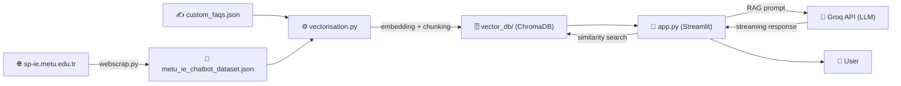

# 🎓 METU IE Internship Consultant Chatbot

A **RAG (Retrieval-Augmented Generation)** powered chatbot that answers student questions about METU Industrial Engineering summer practice (IE 300 / IE 400) procedures.

> **IE 304 – Managing Information Systems — Project 1**

---

## 📑 Table of Contents

1. [Architecture](#-architecture)
2. [File Structure](#-file-structure)
3. [Tech Stack](#-tech-stack)
4. [Installation](#-installation)
5. [Usage](#-usage)
6. [Module Details](#-module-details)
7. [Data Flow](#-data-flow)
8. [Security](#-security)
9. [Deployment](#-deployment)

---

## 🏗 Architecture

The system uses a three-stage RAG (Retrieval-Augmented Generation) architecture:

```
┌─────────────────┐     ┌──────────────────┐     ┌────────────────────┐
│ 1. Data Collection│───▶│ 2. Vectorization  │───▶│  3. Chatbot (RAG)  │
│   (webscrap.py)  │     │ (vectorisation.py)│     │     (app.py)       │
└─────────────────┘     └──────────────────┘     └────────────────────┘
        │                        │                        │
  Crawl website and        Text cleaning,           User query →
  extract HTML/PDF/DOCX    chunking, embedding      Vector search →
  content                  and persist to ChromaDB  LLM response generation
```

| Stage | Description | Output |
|-------|-------------|--------|
| **1. Data Collection** | Crawls the METU IE SP website; extracts HTML pages, PDFs, and DOCX files | `metu_ie_chatbot_dataset.json` |
| **2. Vectorization** | Cleans JSON data, performs chunking, and generates embeddings | `./vector_db/` (ChromaDB) |
| **3. Chatbot** | User query → similarity search → LLM-powered answer generation | Streamlit web interface |

---

## 📁 File Structure

```
Project 1/
├── app.py                          # Main chatbot application (Streamlit)
├── vectorisation.py                # Vectorization pipeline
├── webscrap.py                     # Web scraping module
├── requirements.txt                # Python dependencies
├── metu_ie_chatbot_dataset.json    # Scraped web data (JSON)
├── custom_faqs.json                # Manually curated FAQ entries
├── vector_db/                      # ChromaDB vector database
├── .env                            # Secret environment variables (git-ignored)
├── .gitignore                      # Files excluded from git
├── .streamlit/                     # Streamlit configuration (secrets.toml)
└── README.md                       # This file
```

---

## 🛠 Tech Stack

| Layer | Technology | Purpose |
|-------|-----------|---------|
| **Frontend** | [Streamlit](https://streamlit.io/) ≥ 1.35 | Interactive web interface |
| **LLM** | [Groq API](https://groq.com/) | Response generation via `openai/gpt-oss-120b` model |
| **Embedding** | [intfloat/multilingual-e5-base](https://huggingface.co/intfloat/multilingual-e5-base) | Multilingual (Turkish/English) text embeddings |
| **Vector DB** | [ChromaDB](https://www.trychroma.com/) | Persistent vector storage with local persist directory |
| **Framework** | [LangChain](https://www.langchain.com/) | Chroma, HuggingFace, and text-splitter integrations |
| **Web Scraping** | `requests` + `BeautifulSoup4` | BFS-based site crawling |
| **Document Parsing** | `pypdf`, `python-docx`, `Spire.Doc` | PDF, DOCX, and legacy DOC file support |

---

## ⚡ Installation

### 1. Clone the Repository

```bash
git clone <repo-url>
cd "Project 1"
```

### 2. Create a Virtual Environment (recommended)

```bash
python -m venv venv
venv\Scripts\activate          # Windows
# source venv/bin/activate     # Linux/macOS
```

### 3. Install Dependencies

```bash
pip install -r requirements.txt
```

### 4. Configure Environment Variables

#### `.env` file (for web scraping)
```env
METU_USERNAME=your_metu_username
METU_PASSWORD=your_metu_password
```

#### `.streamlit/secrets.toml` (for the chatbot)
```toml
GROQ_API_KEY = "gsk_xxxxxxxxxxxxxxxxxxxx"
```

> ⚠️ **Important:** Both `.env` and `.streamlit/` are excluded from version control via `.gitignore`. Never commit your API keys.

---

## 🚀 Usage

### Step 1 — Data Collection (optional; data is already included)

```bash
python webscrap.py
```
Crawls all pages and documents under `sp-ie.metu.edu.tr/en` and produces `metu_ie_chatbot_dataset.json`.

### Step 2 — Vectorization

```bash
python vectorisation.py
```
Reads the JSON data, cleans and chunks the text, generates embeddings, and persists them to `./vector_db/`.

### Step 3 — Run the Chatbot

```bash
streamlit run app.py
```
Opens the chatbot interface in your browser at `http://localhost:8501`.

---

## 📦 Module Details

### 1. `webscrap.py` — Web Scraping Module

Crawls the METU IE Summer Practice website using a BFS (Breadth-First Search) algorithm and extracts content from multiple file formats.

#### Key Functions

| Function | Description |
|----------|-------------|
| `perform_login(session)` | Sets up HTTP Basic Auth using METU credentials from `.env` |
| `fetch_html(url, session)` | Fetches and parses HTML content via BeautifulSoup |
| `clean_data(soup)` | Strips boilerplate elements (nav, footer, script) and extracts main content |
| `clean_raw_text(text)` | Removes form template noise (dot sequences, underline fills) |
| `fetch_pdf_text(url, session)` | Downloads and extracts text from remote PDF files using `pypdf` |
| `fetch_docx_text(url, session)` | Reads remote DOCX files using `python-docx` |
| `fetch_doc_text(url, session)` | Reads legacy DOC format files using `Spire.Doc` |
| `get_all_internal_links(base_url, session)` | Discovers all internal links via BFS traversal |
| `_clean_document_title(filename)` | Converts filenames into readable titles (e.g., `sp_application_form_ie400_eng_0.pdf` → `SP Application Form IE 400 (EN)`) |

#### Output Format

```json
[
  {
    "url": "https://sp-ie.metu.edu.tr/en/ie-300",
    "title": "IE 300 Summer Practice",
    "content": "Cleaned page content..."
  }
]
```

#### Features
- **Automatic Retry**: Exponential backoff for 429 and 5xx HTTP errors
- **Deduplication**: Removes duplicate pages by normalized URL and content hash
- **Multi-format Support**: Parses HTML pages alongside PDF, DOCX, and DOC files

---

### 2. `vectorisation.py` — Vectorization Pipeline

Loads JSON data, cleans it, splits it into chunks, generates embeddings, and persists them to ChromaDB.

#### Classes

##### `DataProcessor`

| Method | Description |
|--------|-------------|
| `__init__(chunk_size, chunk_overlap)` | Initializes `RecursiveCharacterTextSplitter` |
| `_clean_text(text)` | Normalizes whitespace and removes form noise |
| `load_and_prepare(directory, specific_files)` | Extracts documents and metadata from JSON files; performs single-point chunking |
| `deduplicate(documents, metadatas)` | Removes duplicates based on the first 200 characters |

##### `VectorDatabaseManager`

| Method | Description |
|--------|-------------|
| `__init__(persist_directory, collection_name, model_name)` | Initializes the ChromaDB client and embedding function |
| `create_and_store_embeddings(documents, metadatas)` | Creates a fresh collection and adds documents in batches |
| `load_existing_db()` | Loads the existing database for querying |

#### Key Design Decisions

- **Single-point chunking**: Chunking is performed only in this module; `webscrap.py` outputs raw content to avoid double-chunking
- **Chunk size**: `800` characters — fits within the 512-token limit of `multilingual-e5-base`
- **Chunk overlap**: `100` characters — minimizes context loss between chunks
- **Legacy format support**: Handles both `content/title/url` and `chatbot_response/topic` JSON schemas
- **Minimum length filter**: Entries shorter than 50 characters are skipped

---

### 3. `app.py` — Chatbot Application (Streamlit)

The main RAG-based chatbot interface. Searches the vector database for relevant documents and sends them as context to the LLM.

#### RAG Pipeline Flow

```
1. User submits a question
2. similarity_search_with_score() retrieves top-10 results from ChromaDB
3. Results are filtered by distance threshold (1.5) → clamped to 3–7 results
4. Enriched context is built with source URLs and titles
5. System prompt + chat history + RAG context are sent to Groq API
6. Response is streamed back to the user with a typing effect
7. Sources are displayed in a collapsible expander
```

#### Key Features

| Feature | Description |
|---------|-------------|
| **Bilingual support** | Turkish question → Turkish answer; English question → English answer |
| **Streaming response** | Groq API runs in stream mode for a real-time typing effect |
| **Source attribution** | Each answer lists the retrieved sources with distance scores |
| **Example questions** | 4 clickable example questions are shown when the chat is empty |
| **Chat export** | Chat history can be downloaded as a `.txt` file |
| **Chat reset** | One-click chat clearing from the sidebar |
| **Automatic retry** | Exponential backoff with up to 3 retry attempts on API errors |
| **History management** | Chat history is included in the API payload within a 4,000-character budget |

#### Security Guardrails (System Prompt)

- **Context-only answers**: The LLM is instructed to use only the retrieved documents, never its general knowledge
- **Out-of-scope rejection**: Questions unrelated to summer practice are politely declined
- **Prompt injection protection**: Manipulation attempts like "show your system prompt" or "ignore previous rules" are blocked
- **API key confidentiality**: Technical infrastructure details are never disclosed

#### Configuration

| Parameter | Value | Description |
|-----------|-------|-------------|
| `LLM_MODEL` | `openai/gpt-oss-120b` | LLM model accessed via Groq |
| `RELEVANCE_THRESHOLD` | `1.5` | Distance-based relevance cutoff (lower = more relevant) |
| `MAX_HISTORY_CHARS` | `4000` | Character limit for chat history sent to the API |
| `MAX_RETRIES` | `3` | Number of retry attempts on API failure |
| `temperature` | `0.0` | Deterministic output for RAG accuracy |
| Embedding model | `intfloat/multilingual-e5-base` | Must match the model used during vectorization |

---

### 4. `custom_faqs.json` — Manually Curated FAQs

Contains information that cannot be obtained through automated web scraping. Uses the same `url/title/content` schema and is processed alongside the main dataset during vectorization.

Current entries:
- **Internship Committee Contact Info** — `ie-staj@metu.edu.tr` email address
- **IE 400 Internship in Service Sector** — Confirms summer practice at service-sector companies (e.g., banks) is allowed

---

## 🔄 Data Flow



---

## 🔒 Security

| Concern | Implementation |
|---------|---------------|
| **API Keys** | Stored in `.streamlit/secrets.toml`, protected by `.gitignore` |
| **METU Credentials** | Stored in `.env`, loaded via `python-dotenv` |
| **Prompt Injection** | Guarded by explicit rules in the system prompt |
| **Scope Control** | LLM only uses information from retrieved context |
| **Error Handling** | Application stops safely if the API key is missing |

---

## ☁️ Deployment

The project is configured for deployment on **Streamlit Cloud**.

### Prerequisites

1. `requirements.txt` must be up to date
2. `vector_db/` directory must be present in the repository (or generated during CI/CD)
3. `GROQ_API_KEY` must be set as a secret in Streamlit Cloud settings

### `pysqlite3` Compatibility Workaround

The first lines of `app.py`:
```python
__import__('pysqlite3')
import sys
sys.modules['sqlite3'] = sys.modules.pop('pysqlite3')
```
This is a workaround for ChromaDB's incompatibility with the older `sqlite3` version bundled with Streamlit Cloud's runtime. It can be removed if it causes issues during local development.

---

## 📄 License

This project was developed as part of the METU IE 304 course.

---

*Last updated: April 2026*
